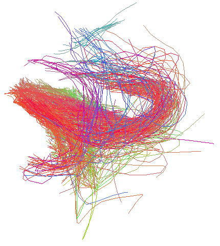
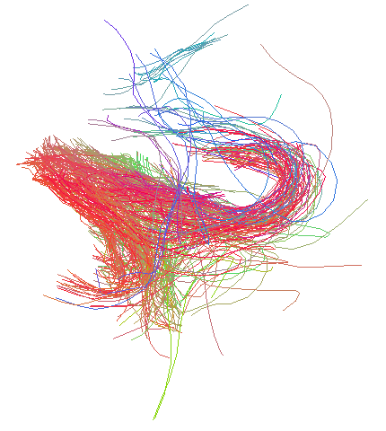
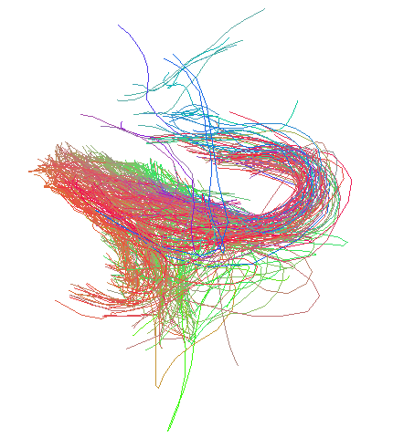
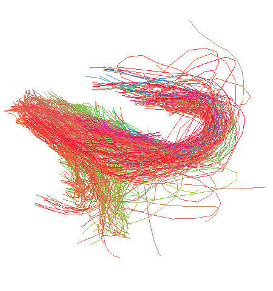

# Tabla de contenidos

   1. [Descripción](#Descripción)
   2. [Contenido](#Contenido)
      1. [directory.h](#directory.h)
      2. [moreMath.h](#moreMath.h)
      3. [fiberlib.h](#fiberlib.h)
      4. [sspdlib.h](#sspdlib.h)
      5. [isomap.h](#isomap.h)
   3. [Resultados](#resultados)
   4. [Observaciones](#observaciones)


# Descripción: <a name="Descripción"></a>

El presente repositorio contiene el algoritmo utilizado al momento de la presentación de la memoria de título **"OPTIMIZACIÓN EN ALGORITMO DE SEGMENTACIÓN AUTOMÁTICA DE FASCÍCULOS DE MATERIA BLANCA SUPERFICIAL EN DATOS DE TRACTOGRAFÍAS PROBABILÍSTICAS"**, desarrollado por **Felipe Pineda S.** para optar al grado de ingeniero civíl electrónico en la Universidad de Concepción.

En este, se desarrolla una implementación en C del algoritmo de filtrado desarrollado en Python por **Cristobal Mendoza s.** en la memomria de título "**MEJORA DE SEGMENTACIÓN AUTOMÁTICA DE FASCÍCULOS DE MATERIA BLANCA SUPERFICIAL EN DATOS DE TRACTOGRAFÍAS PROBABILÍSTICA**".

 El objetivo principal de esta implementación es disminuir el tiempo de ejecución en el algoritmo de filtrado de fibras ruidosas usando la distancia SSPD como métrica comparativa entre fibras. Como objetivo se desarrollaron archivos de encabezados que simplifican el trabajo con fibras en C, los cuales servirán para futuros trabajos en este ámbito.


# Contenido: <a name="Contenido"></a>

- **Librerias en C**: Separadas en sus archivos de encabezado (.h) y definición (.c) ubicados en el directorio ```headers_sources```.
   - **"directory.h" <sup>(1)</sup>**: _Librería dedicada a facilitar la navegación entre archivos y directorios (Requiere librería "dirent.h")._
   - **"moreMath.h"**: _Contiene funciones matemáticas adicionales para facilitar la obtención métricas básicas (distancia euclídea en 2 y 3 dimensiones) y operación entre matrices._
   - **"fiberlib.h"**: _Librería dedicada al trabajo con fibras. Contiene las estructuras 'fiber' y 'fasciculus' las cuales respresentan a las fibras individuales y a un conjunto de fibras respectivamente y funciones para la lectura y escritura de archivos relacionados con fibras, métricas de fibras entre otras (Requiere el uso de la librería "mormeMath.h")._
   - _**"sspdlib.h"**: Contiene las funciones utilizadas para el cómputo de la distancia SSPD (Requiere el uso de las ibrerías "moreMath.h" y "fiberlib.h")._
   - **"isomap.h"**: _Contiene las funciones utilizadas para aplicar los algoritmos de ISOMAP y MDS cláisco **<sup>(2)</sup>**._

- **Archivos main.c**: Las implementaciones de los algoritmos de filtrado por ISOMAP y SSPD_3D estan ubicados en sus respectivos directorios. De forma adicional al filtrado se añadió al script una sección que mide el tiempo de filtrado por fascículo. En el caso del filtrado por ISOMAP, se muestra el tiempo empleado por la reduccion dimensional (ISOMAP o MDS) y el tiempo empleado total (reducción dimensional y filtrado) por fascículo.

- **Archivos de MATLAB (.m)**: Contiene una implmenetación simplificada del algoritmo de MDS y un visualizador de fibras en espacio tridimensional y bidimensional. Este algoritmo fue desarrollado con el fin de corroborar los resultados obtenidos mediante la implementación en C

## directory.h <a name="directory.h"></a>

```c
bool endAnalyser(char* terminator, char* file_name)
```
   Función que verifica si el archivo de entrada termina con el terminador indicado.

   **ARGUMENTOS DE ENTRADA:**
   - ```terminator``` :Terminador a verificar.
   - ```file_name``` : Nombre del archivo de entrada.

   **Retorno:** Retorna true si el archivo termina con el terminador, false en caso contrario.

----

```c
char** extFinder(char* cdir,char* ext,int* n)
```
   Función que busca archivos con la extensión indicada en el directorio indicado.

   **ARGUMENTOS DE ENTRADA:**
   - ```cdir``` : Directorio donde se buscarán los archivos.
   - ```ext``` : Extensión de los archivos a buscar.

   **ARGUMENTOS DE SALIDA** (Paso por referencia):  
   - ```n``` : Puntero a una variable que almacenará el número de archivos encontrados.

   **RETORNO:** Retorna un arreglo de strings con la extensión indicada.

---

```c	
void replaceChar(char* strDest,int len, char orig, char newChar)
```
   Función que reemplaza todas las ocurrencias de un caracter en una cadena de caracteres.

   **ARGUMENTOS DE ENTRADA:**
   - ```strDest``` : Strings donde se realizará la reemplazo.
   - ```len``` : Largo del string.
   - ```orig``` : Caracter presente en ```strDest``` a reemplazar.
   - ```newChar``` : Caracter por el cual se reemplazará.

---

```c
int* name2num(char** nameList,int numFiles)
```
   Función que convierte una lista de nombres de archivos en una lista de números.

   **ARGUMENTOS DE ENTRADA:**
   - ```nameList``` : Lista de nombres de archivos.
   - ```numFiles``` : Número de archivos en la lista.

   **RETORNO:** Retorna un arreglo de enteros con los números de los archivos.

---

```c
char** num2name(int* numList, int numFiles)
```
   Función que convierte una lista de enteros en una lista de nombres de archivos.
   
   **ARGUMENTOS DE ENTRADA:**
   - ```numList``` : Lista de enteros.
   - ```numFiles``` : Número de archivos en la lista.

   **RETORNO:** Retorna un arreglo de strings con los nombres de los archivos con la extensión .bundles.

---

```c
void get_current_dir(char c_dir[PATH_MAX])
```
   Función que obtiene el directorio actual.

   **ARGUMENTOS DE SALIDA** (Paso por referencia):
   - ```c_dir``` : Cadena de caracteres donde se guardará el directorio actual.

## moreMath.h <a name="moreMath.h"></a>

```c
float eucDisPP(float* p1, float*p2)
float eucDisPP_2d(float* p1, float*p2)
```

   Funciónes que calcula la distancia euclídea entre dos puntos en 3 y 2 dimensiones respectivamente.

   **ARGUMENTOS DE ENTRADA:**
   - ```p1``` : Punto 1.
   - ```p2``` : Punto 2.

   **RETORNO:** Retorna la distancia euclídea entre los dos puntos.
   
---

```c
float* matrix_sum(float** matrix, int rows, int cols, short axis)
float* matrix_sum_op(float** matrix, int len)
void matrix_sum_py(int len, float** matrix, float sum[len])
```
   Función que realiza la suma por filas o por columnas de los elementos de una matriz

   **ARGUMENTOS DE ENTRADA:**
   - ```matrix``` : Matriz de la cual se realizará la suma.
   - ```rows``` : Número de filas de la matriz.
   - ```cols``` : Número de columnas de la matriz.
   - ```axis``` : Indica si se realizará la suma por filas (1) o por columnas (0).
   - ```len``` : Número de filas y columnas de una matriz cuadrada.

   **ARGUMENTOS DE SALIDA** (Paso por referencia):
   - ```sum``` : Arreglo que almacenará los resultados de la suma.

   **RETORNO:** Retorna un arreglo con los resultados de la suma por fila o columna de la matriz.
   
---

```c
void m_transpose(int row, int col, float matrix[row][col], float mat_tr[col][row])
```
   Función que obtiene una matriz traspuesta a partir de una matriz de entrada.

   **ARGUMENTOS DE ENTRADA:**
   - ```row``` : Número de filas de la matriz.
   - ```col``` : Número de columnas de la matriz.
   - ```matrix``` : Matriz a transponer.

   **ARGUMENTOS DE SALIDA** (Paso por referencia):
   ```mat_tr``` : Matriz que almacenará la transpuesta.

   ---

```c
void quicksort(float *arr, int N)
```
   Función que ordena un arreglo de forma ascendente.

   **ARGUMENTOS DE ENTRADA:**
   - ```arr``` : Arreglo a ordenar.
   - ```N``` : Número de elementos del arreglo.

---

```c
int* percentile(float arr[], int arr_size, float perc)
```
   Función que obtiene los indices de un arreglo que pertenecen a cierto percentil.

   **ARGUMENTOS DE ENTRADA:**
   - ```arr``` : Arreglo de elementos a ordenar.
   - ```arr_size``` : Número de elementos del arreglo.
   - ```perc``` : Percentil de elementos que se quiere obtener.

   **RETORNO:** Retorna un arreglo con los indices de los elementos que pertenescan al percentil indicado. El primer elemento del arreglo es el elemento que corresponde al numero de elementos indicado por el porcentaje.
   ---

```c
void freeMatrix(float** matrix,int rows)
```
   Liberación de memoria utilizada por una matriz.

   **ARGUMENTOS DE ENTRADA:**
   - ```matrix``` : Matriz a liberar.
   - ```rows``` : Número de filas de la matriz.

## fiberlib.h <a name="fiberlib.h"></a>

```c
typedef struct {
   int numPts;
   float** cordinates;
}fiber;
```
   Estructura que representa una fibra.
   - ```numPts``` : Número de puntos de la fibra.
   - ```cordinates``` : Arreglo bidimensional de floats que almacenan las coordenadas de los puntos de la fibra. El uso de memoria dinamica permite permite la creación de fibras con cualquier número de puntos en 2 y 3 dimensiones.

---

```c	
typedef struct {
   char name[60];
   int numFibers;
   fiber* fibers;
} fasciculus;
```
   Estructura que representa un conjunto de fibras (fasciculo).
   - ```name``` : Nombre del fasciculo.
   - ```numFibers``` : Número de fibras en el fasciculo.
   - ```fibers``` : Arreglo de fibras.

---

```c
fasciculus readBundle(char* fileName,char* path)
```
   Función que lee un par de archivos (.bundles y .bundlesdata) que contiene los datos de un conjunto de fibras y los guarda en una variable del tipo fasciculo.

   **ARGUMENTOS DE ENTRADA:**
   - ```fileName``` : Nombre del archivo de fibras.
   - ```path``` : Ruta del archivo de fibras.

   **RETORNO:** Retorna una estructura de tipo fasciculo con los datos obtenidos de los archivos.

---

```c
void writeBundles(fasciculus bundle, char* fileName,char* path)
```
   Función que escribe en un par de archivos (.bundles y .bundlesdata) los datos de un fasciculo.

   **ARGUMENTOS DE ENTRADA:**
   - ```bundle``` : Estructura de tipo fasciculo que contiene los datos a escribir.
   - ```fileName``` : Nombre del archivo de fibras.
   - ```path``` : Ruta del archivo de fibras.

---

```c
void clearBundle(fasciculus bundle)
```
   Función que libera la memoria de una estructura de tipo fasciculus y la memoria de las estructuras tipo fibras a las que hace referencia.

   **ARGUMENTOS DE ENTRADA:**
   - ```bundle``` : Estructura de tipo fasciculo.

---

```c
fasciculus selectFibers(fasciculus bundle, int* selected)
```
   Función que selecciona una lista de fibras de una estructura de tipo fasciculo y la guarda en una nueva estructura de tipo fasciculo.

   **ARGUMENTOS DE ENTRADA:**
   - ```bundle``` : Estructura de tipo fasciculo que contiene las fibras a seleccionar.
   - ```selected``` : Arreglo de N+1 enteros que contiene los indices de las N fibras a seleccionar. El primer elemento del arreglo es la cantidad de fibras a seleccionar.

   **RETORNO:** Retorna una estructura de tipo fasciculo con las fibras seleccionadas.
---

```c
float fiberlen(fiber fib)
```
   Función que retorna la longitud de una fibra.

   **ARGUMENTOS DE ENTRADA:**
    -```fib``` : Estructura de tipo fibra que contiene los datos de la fibra.

   **RETORNO:** Retorna la longitud de la fibra.

---

```c
void fiberSwap(fiber* f1, fiber* f2, int dim)
```
   Función que intercambia los indices de dos fibras en un arreglo de fibras. (Se pensaba implementar un algoritmo de orden para dercartar las fibras que no cumplen con el criterio de ordenamiento).

   **ARGUMENTOS DE ENTRADA:**
   - ```f1```: Estructura de tipo fibra que contiene los datos de la fibra 1.
   - ```f2```: Estructura de tipo fibra que contiene los datos de la fibra 2.
   - ```dim```: Dimensión de las fibras (2D o 3D).

## sspdlib.h <a name="sspdlib.h"></a>

Esta librería se encarga de implementar los algoritmos para calcular la distantcia SSPD entre dos fibras, y para calcular una matriz de distancias entre todas las fibras de un fasciculo. En esta libreria todas las funciones tienen una version **_py** que es una adaptación de la funcion correspondiente en Python. El uso de las versiones **_py** en todas las funciones requieren de argumentos adicionales, pero son más eficientes en tiempo de ejecución, y fueron estas, las utilizadas en la versión final de este trabajo.

```c
float point_to_seg(float* p, float* s1, float* s2)
float point_to_seg_2d(float* p, float* s1, float* s2)
float point_to_seg_py(float* p, float* s1, float* s2, float dps1, float dps2, float dss);
float point_to_seg_2d_py(float* p, float* s1, float* s2, float dps1, float dps2, float dss);
```
   Funciones que retornan la distancia entre un punto y un segmento de recta. Las funciones **_2d** son para el caso de que las coordenadas de los puntos sean 2D.

   **ARGUMENTOS DE ENTRADA:**
   - ```p``` : Coordenadas del punto a evaluar.
   - ```s1``` : Coordenadas del primer punto extremo del segmento.
   - ```s2``` : Coordenadas del egundo punto extremo del segmento.
   - ```dps1``` : Distancia del punto al extremo s1 del segmento.
   - ```dps2``` : Distancia del punto al extremo s2 del segmento.
   - ```dss``` : Longitud del segmento.

   **RETORNO:** Retorna la distancia entre el punto y el segmento.

---

```c
float point_to_fiber(float* p, fiber f, float (*pnt2seg)(float*,float*,float*))
float point_to_fiber_py(float* p, fiber f, float mdist_p[f.numPts], float t_dist[f.numPts-1], int dim)
```
   Distancia entre un punto y una trayectoria (fibra).

   **ARGUMENTOS DE ENTRADA:**
   - ```p``` : Coordenadas del punto a evaluar.
   - ```f``` : Estructura de tipo fibra que contiene los datos de la fibra (número de puntos y coordenadas).
   - ```pnt2seg``` : Función que retorna la distancia entre un punto y un segmento de recta. (Permite la implementación de distancias 2D o 3D).
   - ```mdist_p``` : Arreglo de N valores que contiene las distancias desde el punto p a cada uno de los N puntos de la fibra f.
   - ```t_dist``` : Arreglo de N-1 valores que contiene las distancias entre puntos consecutivos de la fibra f.
   - ```dim``` : Dimensión de las fibras (2 o 3).

   **RETORNO:** Retorna la distancia entre el punto y la fibra.

---

```c
float e_spd(fiber f1, fiber f2,float (*pnt2seg)(float*,float*,float*))
float e_spd_py(fiber f1, fiber f2, float mdist[f1.numPts][f2.numPts], float t2_dist[f2.numPts-1], int dim)

```

   Distancia SPD entre 2 trayectorias (fibras): Corresponde a la distancia promedio entre todos los puntos de una fibra (f1) y los segmentos de otra fibra (f2).

   **ARGUMENTOS DE ENTRADA:**
   - ```f1``` : Estructura de tipo fibra que contiene los datos de la fibra 1.
   - ```f2``` : Estructura de tipo fibra que contiene los datos de la fibra 2.
   - ```pnt2seg``` : Función que retorna la distancia entre un punto y un segmento de recta. (Permite la implementación de distancias 2D o 3D).
   - ```mdist``` : Arreglo de NxM valroes que contiene las distancias desde los N puntos de la fibra f1 a los M puntos de la fibra f2.
   - ```t2_dist``` : Arreglo de M-1 valores que contiene las distancias entre puntos consecutivos de la fibra f2.
   - ```dim``` : Dimensión de las fibras (2 o 3).

   **RETORNO:** Retorna la distancia SPD dos fibras.

---

```c
float e_sspd(fiber f1, fiber f2, float (*pnt2seg)(float*,float*,float*))
float e_sspd_py(fiber f1, fiber f2, int dim)
```

   Distancia SSPD entre 2 trayectorias (fibras): Corresponde al promedio de la distancia SPD(f1,f2) y distancia SPD(f2,f1).

   **ARGUMENTOS DE ENTRADA:**
   - ```f1``` : Estructura de tipo fibra que contiene los datos de la fibra 1.
   - ```f2``` : Estructura de tipo fibra que contiene los datos de la fibra 2.
   - ```pnt2seg``` : Función que retorna la distancia entre un punto y un segmento de recta. (Permite la implementación de distancias 2D o 3D).
   - ```dim``` : Dimensión de las fibras (2 o 3).

   **RETORNO:** Retorna la distancia SSPD entre dos fibras.
---

```c
void ssdpd_matrix(fasciculus b1, fasciculus b2, float matrix[b1.numFibers][b2.numFibers],float (*pnt2seg)(float*,float*,float*))
float** OMP_ssdpd_matrix_op(fasciculus b1,float (*pnt2seg)(float*,float*,float*))
float** ssdpd_matrix_py(fasciculus b1, fasciculus b2, int dim)
float** ssdpd_matrix_py_op(fasciculus b1, int dim)
```

   Matriz de distancias SSPD entre un conjunto de trayectorias (fibras). Las funciones ```ssdpd_matrix``` y ```ssdpd_matrix_py``` calculan la matriz de distancias SSPD entre 2 conjuntos de trayectorias diferentes. Debido a que en este trabajo no requiere comparar trayectorias de conjuntos diferentes, las entradas ```b1``` y ```b2``` son iguales.

   Las funcion ```OMP_ssdpd_matrix_op``` y ```ssdpd_matrix_py_op``` calcula la matriz de distancias SSPD entre fibras de un mismo conjunto de trayectorias (fibras). Esta funcion utiliza la capacidad de computo multihebra de OpenMP para acelerar el tiempo de cómputo.

   **ARGUMENTOS DE ENTRADA:**
   - ```b1``` : Estructura de tipo fasciculo que contiene los datos las fibras del facículo 1.
   - ```b2``` : Estructura de tipo fasciculo que contiene los datos las fibras del facículo 2.
   - ```pnt2seg``` : Función que retorna la distancia entre un punto y un segmento de recta. (Permite la implementación de distancias 2D o 3D).
   -```dim``` : Dimensión de las fibras (2 o 3).

   **ARGUMENTOS DE SALIDA** (Paso por referencia):
   - ```matrix``` : Matriz de distancias SSPD entre las fibras del fascículo 1 y las fibras del fascículo 2.

   **RETORNO:** Retorna la matriz de distancias SSPD entre las fibras del fascículo.

## isomap.h <a name="isomap.h"></a>
```c
void dist_mat_op(float** coord, int num_points, float matrix[num_points][num_points]);
```
   Calcula la matriz de distancias entre todos los pares de puntos posibles de un conjunto de puntos (coord).

   **ARGUMENTOS DE ENTRADA:**
   - ```coord``` : Matriz de coordenadas de los puntos.
   - ```num_points``` : Número de puntos del conjunto de puntos.

   **ARGUMENTOS DE SALIDA** (Paso por referencia):
   - ```matrix``` : Matriz de distancias entre todos los pares de puntos posibles.
 
---

```c
void swap_f(float *xp, float *yp);
void swap_i(int *xp, int *yp);
```
   Funciones que permite intercambiar dos valores de tipo float o int.

   **ARGUMENTOS DE ENTRADA:**
   - ```xp``` : Puntero al valor a intercambiar.
   - ```yp``` : Puntero al valor a intercambiar.

---

```c
void find_kmin_index(int n, float arr[n], int k, int k_min[k]);
```
   Función que encuentra los k valores más pequeños de un arreglo de valores de tipo float.

   **ARGUMENTOS DE ENTRADA:**
   - ```n``` : Número de valores del arreglo.
   - ```arr``` : Arreglo de valores de tipo float.

   **ARGUMENTOS DE SALIDA** (Paso por referencia):
   - ```k_min``` : Arreglo de valores de tipo int que contiene los k valores más pequeños del arreglo.

---

```c
void knn_list(int n, float d_mat[n][n],  int k, int knn_mat[n][k]);
```
   Función que encuentra los k vecinos más cercanos de cada punto de una matriz de distancias.

   **ARGUMENTOS DE ENTRADA:**
   - ```n``` : Tamaño de la matriz de distancias (Matriz cuadrada).
   - ```d_mat``` : Matriz de distancias.
   - ```k``` : Número de vecinos más cercanos a considerar.

   **ARGUMENTOS DE SALIDA** (Paso por referencia):
   - ```knn_mat``` : Matriz de vecinos más cercanos.

---

```c
bool n_in_array(int n, int dim ,int arr[dim]);
```
   Función que determina si un valor de tipo int está en un arreglo de valores de tipo int.

   **ARGUMENTOS DE ENTRADA:**
   - ```n``` : Valor de tipo int a buscar.
   - ```dim``` : Número de valores del arreglo.
   - ```arr``` : Arreglo de valores de tipo int.

   **RETORNO:** Retorna true si el valor está en el arreglo, false en caso contrario.

---

```c
void graph_mat(int n, float d_mat[n][n], int k,float graph[n][n]);
```
   Función que calcula la matriz de grafo a partir de una matriz de distancias.

   **ARGUMENTOS DE ENTRADA:**
   - ```n``` : Tamaño de la matriz cuadrada.
   - ```d_mat``` : Matriz de distancias.
   - ```k``` : Número de vecinos más cercanos a considerar.

   **ARGUMENTOS DE SALIDA** (Paso por referencia):
   - ```graph``` : Matriz de grafo.

---

```c
int find_min_index(int n, float arr[n]);
```
   Función que encuentra el índice del valor más pequeño de un arreglo de valores de tipo float.

   **ARGUMENTOS DE ENTRADA:**
   - ```n``` : Número de valores del arreglo.
   - ```arr``` : Arreglo de valores de tipo float.

   **RETORNO:** Retorna el índice del valor más pequeño.

---

```c
bool all_visited(int n, bool visited[n]);
```
   Función aplicada en un algorimto de Dijkstra para determinar si todos los nodos han sido visitados.

   **ARGUMENTOS DE ENTRADA:**
   - ```n``` : Número de nodos.
   - ```visited``` : Arreglo de valores de tipo bool que indica si un nodo ha sido visitado o no.

   **RETORNO:** Retorna true si todos los nodos han sido visitados, false en caso contrario.

---

```c
bool dijkstra( int n, float graph[n][n], int start, float short_path[n]);
```
   Función que implementa el algoritmo de Dijkstra para encontrar el camino más corto desde un nodo inicial a todos los demás.

   **ARGUMENTOS DE ENTRADA:**
   - ```n``` : Número de nodos.
   - ```graph``` : Matriz de grafo.
   - ```start``` : Nodo inicial.

   **ARGUMENTOS DE SALIDA** (Paso por referencia):
   - ```short_path``` : Arreglo de valores de tipo float que contiene la longitud del camino más corto desde el nodo inicial a todos los demás.

   **RETORNO:** Retorna true si se ha encontrado un error para aplicar el algoritmo, false en caso contrario.

---

```c
bool geodesic_mat(int n, float graph[n][n], float geo_dist[n][n]);
```
   Función que calcula la matriz de distancias geodesicas a partir de una matriz de grafo.

   **ARGUMENTOS DE ENTRADA:**
   - ```n``` : Número de nodos.
   - ```graph``` : Matriz de grafo.

   **ARGUMENTOS DE SALIDA** (Paso por referencia):
   - ```geo_dist``` : Matriz de distancias geodesicas.

   **RETORNO:** Retorna true si se ha encontrado un error para aplicar el algoritmo, false en caso contrario.

---

```c
void fiber2geomat(int n, float** coord, int k, float geomat[n][n]);
```
   Función que calcula la matriz de distancias geodesicas a partir de un vector de coordenadas tridimensionales.

   **ARGUMENTOS DE ENTRADA:**
   - ```n``` : Número de coordenadas.
   - ```coord``` : Matriz de coordenadas.
   - ```k``` : Número de vecinos más cercanos a considerar.

   **ARGUMENTOS DE SALIDA** (Paso por referencia):
   - ```geomat``` : Matriz de distancias geodesicas.

---

```c
void centering_matrix(int n, float c_mat[n][n]);
```
   Función que calcula una matriz de centrado de tamano nxn.

   **ARGUMENTOS DE ENTRADA:**
   - ```n``` : Tamaño de la matriz.

   **ARGUMENTOS DE SALIDA** (Paso por referencia):
   - ```c_mat``` : Matriz de centrado.

---

```c
void sqr_dot_product(int dim, float M[dim][dim], float N[dim][dim],float X[dim][dim]);
```
   Función que calcula el producto punto de dos matrices cuadradas de tamano dim.

   **ARGUMENTOS DE ENTRADA:**
   - ```dim``` : Tamaño de las matrices.
   - ```M``` : Matriz 1 de tamano dimxdim.
   - ```N``` : Matriz 2 de tamano dimxdim.

   **ARGUMENTOS DE SALIDA** (Paso por referencia):
   - ```X``` : Matriz resultante de tamano dimxdim.

---

```c
void sqr_matrix(int dim, float M[dim][dim]);
void sqr_matrix_op(int dim, float M[dim][dim]);
```
   Función que eleva al cuadrado todos los elementos de una matriz cuadrada de tamano dim. La versión **_op** es para operar con matrices simétricas y tiene un menor coste computacional.

   **ARGUMENTOS DE ENTRADA:**
   - ```dim``` : Tamaño de la matriz.
   - ```M``` : Matriz de tamano dimxdim (Esta matriz se modifica).

---

```c
void dbl_centered_matrix( int n, float mat[n][n], float B[n][n]);
void dbl_centered_matrix_op( int n, float mat[n][n], float B[n][n]);
```
   Función que realiza el doble centrado de una matriz. La versión **_op** es para operar con matrices simétricas y tiene un menor coste computacional.

   **ARGUMENTOS DE ENTRADA:**
   - ```n``` : Tamaño de la matriz.
   - ```mat``` : Matriz de tamano nxn.

   **ARGUMENTOS DE SALIDA** (Paso por referencia):
   - ```B``` : Matriz resultante de tamano nxn.

---

```c
void MDS_2D(int n, float** coord, int iter, float MDS[2][n], void(*dc_mat)(int,float[n][n],float[n][n]));
```
   Función que implementa el algoritmo de MDS sobre una matriz de coordenadas tridimensionales y realizar su reduccion dimensional. En la aplicación de este algoritmo se calculan valores propios de la matriz mediante el algoritmo de Jacobi, el cual utiliza un metodo iterativo, por lo que a mayor iteración, mayor precision.

   **ARGUMENTOS DE ENTRADA:**
   - ```n``` : Número de coordenadas.
   - ```coord``` : Matriz de coordenadas.
   - ```iter``` : Número de iteraciones (Se recomienda un valor de 20 o más).
   - ```dc_mat``` : Función que calcula la matriz de centrado.

   **ARGUMENTOS DE SALIDA** (Paso por referencia):
   - ```MDS``` : Matriz de coordenadas bidimensionales.

---

```c
void ISOMAP_2D(int n, float** coord, int k, int iter, float isomap[2][n], void(*dc_mat)(int,float[n][n],float[n][n]));
```
   Función que implementa el algoritmo de ISOMAP sobre una matriz de coordenadas tridimensionales y realizar su reduccion dimensional. En la aplicación de este algoritmo se calculan valores propios de la matriz mediante el algoritmo de Jacobi, el cual utiliza un metodo iterativo, por lo que a mayor iteración, mayor precision.

   **ARGUMENTOS DE ENTRADA:**
   - ```n``` : Número de coordenadas.
   - ```coord``` : Matriz de coordenadas.
   - ```k``` : Número de vecinos más cercanos a considerar.
   - ```iter``` : Número de iteraciones (Se recomienda un valor de 20 o más).
   - ```dc_mat``` : Función que calcula la matriz de centrado.

   **ARGUMENTOS DE SALIDA** (Paso por referencia):
   - ```isomap``` : Matriz de coordenadas bidimensionales.

---

```c
float rad2deg(float rad);
```
   Función que convierte un valor en radianes a grados.

   **ARGUMENTOS DE ENTRADA:**
   - ```rad``` : Valor en radianes.

   **RETORNO:** Valor en grados.

---

```c
float deg2rad(float deg);
```
   Función que convierte un valor en grados a radianes.

   **ARGUMENTOS DE ENTRADA:**
   - ```deg``` : Valor en grados.

   **RETORNO:** Valor en radianes.

---

```c
void rotate_points(float rad, int n, float arr_2d[2][n]);
```
   Función que rota una matriz de coordenadas bidimensionales.

   **ARGUMENTOS DE ENTRADA:**
   - ```rad``` : Valor en radianes.
   - ```n``` : Número de coordenadas.
   - ```arr_2d``` : Matriz de coordenadas bidimensionales (Se modifica).

---

```c
float rad_m(float p1[2], float p2[2]);
```
   Función que calcula el ángulo entre dos puntos en radianes.

   **ARGUMENTOS DE ENTRADA:**
   - ```p1``` : Punto 1.
   - ```p2``` : Punto 2.

---

```c
void flip_ud(int n, float arr_2d[2][n]);
void flip_lr(int n, float arr_2d[2][n]);
```
   Función que invierte los ejes de una matriz de coordenadas bidimensionales. ```flip_ud``` invierte el eje vertical y ```flip_lr``` invierte el eje horizontal.

   **ARGUMENTOS DE ENTRADA:**
   - ```n``` : Número de coordenadas.
   - ```arr_2d``` : Matriz de coordenadas bidimensionales (Se modifica).


# Resultados: <a name="resultados"></a>

### Fascículo sin filtrar


### Fascículo filtrado por ISOMAP


### Fascículo filtrado por MDS


### Fascículo filtrado por SSPD 3D


## Observaciones: <a name="observaciones"></a>

 **(1)** _Además de las librerías desarrolladas, se reaquiere añadir las librerías "strings.h", "limits.h", "math.h", "stdbool.h" y "time.h". En el desarrollo de este algoritmo se utilizó el compilador [MinGW-w64](https://www.mingw-w64.org/), el cual estaba incluído en el IDE, permitiendo el uso de las librearias "dirent.h" para el trabajo con directorios y "omp.h" para el uso de programación paralela._
    
 **(2)** _En el algoritmo de MDS clásico se utiliza ala obtención de los valores propios de una matriz a travéz del método de Jacobi. Para esto se utilizó la implementación desarrollada por **John Burkardt** disponible en https://people.sc.fsu.edu/~jburkardt/c_src/jacobi_eigenvalue/jacobi_eigenvalue.html . Este algoritmo esta bajo la licencia [GNU LGPL](https://www.gnu.org/licenses/lgpl-3.0.en.html)._
